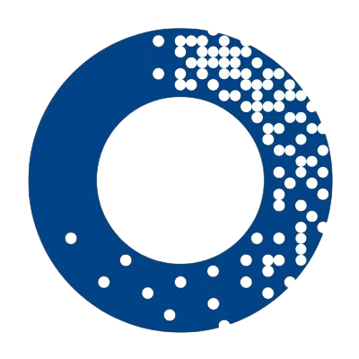

<!-- PROJECT LOGO -->
<br />
<p align="center">
  <a href="https://github.com/edoardodominikus/Adorama-Page">
    
  </a>

  <h3 align="center">Adorama Website Page</h3>

  <p align="center">
   A copy of Adorama.com for self-website-developing practice
    <br />
    <a href="https://edoardodominikus.github.io/Adorama-Page/dist/">View Demo</a>  
  </p>
</p>


<!-- ABOUT THE PROJECT -->
## About The Project

[![Product Name Screen Shot][product-screenshot]](https://example.com)

This is a self-created project to practice what I learnt so far. The reason that I chose this website to try to copy is because I like camera stuffs 📸.

### Built With
* HTML
* SCSS
* Javascript
* Webpack

### NPM Scripts

This is an example of how to list things you need to use the software and how to install them.
* npm build
  ```sh
  webpack -p
  ```
  This command will build your project in production mode and ready to deploy.
  It will also show if there is any error in your code.
* npm start
  ```sh
  webpack-dev-server
  ```
  This command will deploy your code into http://localhost:8889/.
  It will automatically reload if you make changes in your code.
  In other hand, it will show errors in console if there is any.
  


<!-- CONTACT -->
## Contact

Edoardo Dominikus - [connect with me at Linkedin](www.linkedin.com/in/edoardo-dominikus) - edoardodominikus@gmail.com

Project Link: [https://github.com/edoardodominikus/Adorama-Page](https://github.com/edoardodominikus/Adorama-Page)


<!-- ACKNOWLEDGEMENTS -->
## Acknowledgements
* [Owl Carousel](https://owlcarousel2.github.io/OwlCarousel2/)
* [Momentjs](https://momentjs.com/)
* [Browser-sync](https://browsersync.io/)


[linkedin-shield]: https://img.shields.io/badge/-LinkedIn-black.svg?style=for-the-badge&logo=linkedin&colorB=555
[linkedin-url]: http://www.linkedin.com/in/edoardo-dominikus
[product-screenshot]: dist/img/adorama-page.png
